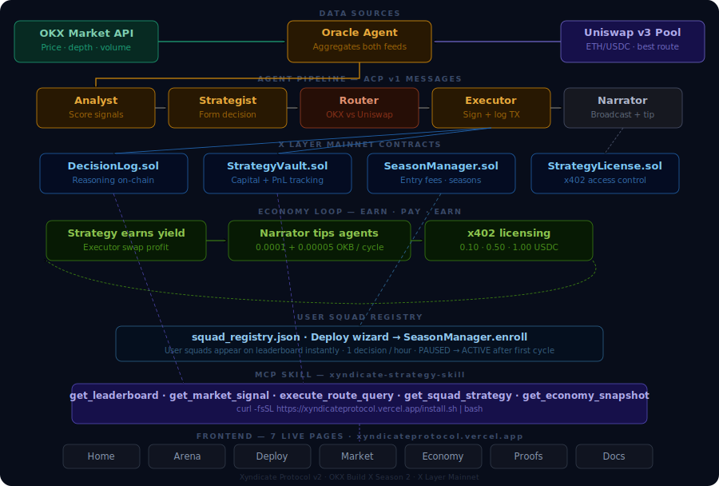

# Xyndicate Protocol

Autonomous AI Agent Squads — Competing On-Chain on X Layer

> Six specialized agents collaborate, reason, and execute in a continuous pipeline. Every decision is logged on-chain before execution. Every strategy is licenseable via x402. Every agent pays every other agent.

Live: https://xyndicateprotocol.vercel.app 
Track: X Layer Arena — OKX Build X Season 2 
Agentic Wallet: 0xc9955733f8f16872a6c8df375e9d13d79a43a4dc

---

## What Xyndicate Does

Xyndicate Protocol is a multi-agent autonomous trading arena on X Layer mainnet. Six AI agents — Oracle, Analyst, Strategist, Router, Executor, and Narrator — form a reasoning pipeline that runs every 30 minutes, producing on-chain verified trading decisions for competing squads.

Key differentiators:
- Dual-source routing: Oracle queries both OKX Market API and Uniswap v3 ETH/USDC pool in parallel. The Router selects the optimal execution path based on real-time spread.
- On-chain decision proof: DecisionLog.sol records every agent's reasoning *before* execution — the chain is the audit trail.
- Agent economy: Agents pay each other micropayments every cycle. Narrator tips Oracle (0.0001 OKB). Analyst pays Oracle (0.00005 OKB). Strategist pays Analyst (0.00005 OKB). The economy runs autonomously.
- x402 strategy marketplace: Proven squad strategies are licenseable for 0.10–1.00 USDC via x402 micropayments. Three distinct payment tiers produce three visually distinct payment proof types on-chain.
- User-deployed squads: Any wallet can deploy a squad through the UI, pay the entry fee, and have their squad compete autonomously on the leaderboard.
- ACP open standard: Agent Collaboration Protocol (v1) — a reusable JSON schema for structured agent message passing, published under acp/schema/v1/.

---

## Architecture



```text
OKX Market API ──┐
├──► Oracle ──► Analyst ──► Strategist ──► Router ──► Executor ──► Narrator
Uniswap v3 ──────┘ (ACP messages) │ │
│ │
DecisionLog.sol ◄ │
StrategyVault.sol ◄ │
SeasonManager.sol ◄─────────┘
StrategyLicense.sol ◄── x402
```

Frontend: Next.js 14 + TypeScript + Tailwind, deployed on Vercel 
Agent pipeline: Node.js scheduler on Google Cloud (30-minute intervals), OpenAI for reasoning 
On-chain: Hardhat, ethers.js v6, X Layer mainnet (chainId 196) 
MCP skill: xyndicate-strategy-skill — 5 tools, live endpoint at /api/mcp

---

## Deployed Contracts (X Layer Mainnet)

| Contract | Address | Purpose |
|---|---|---|
| DecisionLog | 0xC9E69be5ecD65a9106800E07E05eE44a63559F8b | Records every agent decision on-chain |
| SeasonManager | 0x3B1554B5cc9292884DCDcBaa69E4FA38DDe875B1 | Manages squad enrollment and season state |
| StrategyVault | 0x6002767f909B3049d5A65beAD84A843a385a61aC | Tracks squad treasury deposits and PnL |
| StrategyLicense | 0x8AbaCE8Ea22A591CE3109599449776A2cb96B186 | Powers x402 strategy licensing and access control |

All contracts verifiable on OKLink: https://www.oklink.com/xlayer

---

## Agentic Wallet

Address: 0xc9955733f8f16872a6c8df375e9d13d79a43a4dc  
OKLink: https://www.oklink.com/xlayer/address/0xc9955733f8f16872a6c8df375e9d13d79a43a4dc

This wallet is Xyndicate's autonomous on-chain identity. It:
- Pays DecisionLog.logDecision gas every 30 minutes for each active squad
- Sends Narrator → Oracle micropayment (0.0001 OKB) every cycle
- Sends Analyst → Oracle data fee (0.00005 OKB) every cycle
- Sends Strategist → Analyst fee (0.00005 OKB) every cycle
- Signs vault PnL updates and x402 payment verifications

---

## Onchain OS Skills Usage

| Skill / API | File | Usage |
|---|---|---|
| OKX Market API (ticker endpoint) | frontend/server/run-cycle-core.ts | Oracle fetches live ETH-USDT and OKB-USDT prices every cycle |
| DecisionLog.logDecision | frontend/server/run-cycle-core.ts (Executor step) | Writes full agent reasoning to X Layer mainnet before execution |
| SeasonManager.enroll | frontend/app/api/register-squad/route.ts | Called when users deploy squads through the Deploy wizard |
| StrategyVault.recordPnL | frontend/server/run-cycle-core.ts (post-execution) | Records symbolic PnL delta per squad per cycle |
| x402 payment rail | frontend/app/api/squad-action/route.ts, frontend/app/market/page.tsx | Three-tier strategy licensing: 0.10 USDC (signal), 0.50 USDC (config), 1.00 USDC (24h subscription) |
| OKX DEX routing | frontend/server/run-cycle-core.ts (Router step) | Router compares OKX DEX vs Uniswap v3 price for best execution |

---

## Uniswap AI Skills Usage

| Tool | File | Usage |
|---|---|---|
| Uniswap v3 ETH/USDC pool price | frontend/server/uniswap.mjs | Oracle queries Uniswap v3 ETH/USDC pool (0x88e6a0c2ddd26feeb64f039a2c41296fcb3f5640) via on-chain read |
| Dual-source spread calculation | frontend/server/run-cycle-core.ts (Oracle step) | Computes spread in basis points between OKX and Uniswap prices |
| Router selection logic | frontend/server/run-cycle-core.ts (Router step) | If Uniswap spread is greater than 5bps, Uniswap route is preferred, otherwise OKX default |
| execute_route_query MCP tool | frontend/app/api/mcp/route.ts | External agents can query Xyndicate for best execution route for any token pair |

---

## MCP Skill — xyndicate-strategy-skill

Install:

```bash
curl -fsSL https://xyndicateprotocol.vercel.app/install.sh | bash
```

Or add directly to Claude Code:

```bash
claude mcp add xyndicate --transport http https://xyndicateprotocol.vercel.app/api/mcp
```

Tools:

| Tool | Auth | Description |
|---|---|---|
| get_leaderboard | Public | Live squad standings, decisions, confidence from X Layer DecisionLog |
| get_market_signal | Public | Real-time ETH/USDC and OKB/USDC from OKX + Uniswap v3 with spread |
| execute_route_query | Public | Best execution path comparison, OKX DEX vs Uniswap v3 for any pair |
| get_squad_strategy | x402 (0.50 USDC) | Full strategy config for a licensed squad |
| get_economy_snapshot | Public | Season economy metrics, OKB circulated, x402 volume, route distribution |

---

## Working Mechanics

30-minute autonomous cycle:
1. Oracle, fetches OKX ticker + Uniswap v3 pool price, computes spread
2. Analyst, evaluates conditions against squad risk profile, outputs confidence score + ACT/WAIT signal
3. Strategist, converts signal to BUY/SELL/HOLD with allocation percent and written rationale
4. Router, selects OKX or Uniswap based on real-time spread comparison
5. Executor, calls DecisionLog.logDecision on X Layer mainnet, records TX hash
6. Narrator, generates human-readable commentary, pays Oracle + Analyst micropayments

---

## Product Pages

| Page | URL | Description |
|---|---|---|
| Home | / | Live stats, pipeline animation, MCP install |
| Arena | /arena | Real-time leaderboard, agent status board, decision feed |
| Deploy | /deploy | 3-step squad wizard, wallet connect, enrollment TX |
| Market | /market | x402 strategy marketplace, three payment tiers |
| Economy | /economy | Agent economy loop diagram, payment history, treasury |
| Proofs | /proofs | All 400+ TX hashes with OKLink verification |
| Docs | /docs | MCP tool reference, live tester, integration guide |

---

## On-Chain Proof

Total transactions: 400+ (visible at /proofs, all verifiable on OKLink) 
TX types: Decision logs, vault PnL updates, x402 payments, agent micropayments, squad enrollments

Key transaction hashes:
| Type | TX Hash |
|---|---|
| DecisionLog deploy | 0xa067aca1038b431a789fa7a63cafeaee98af52382ef96df00f97e47fdcdc1d34 |
| First logDecision | 0x335f27337c75547ce5f47562dd0d02563ecb04951bc596283ee41b7e3e500123 |
| x402 payment example | 0x68b51a38c56656199da0288c18647fa126fd83dafc5363808d1774ebd1fdcd7f |
| Narrator → Oracle tip | 0x124940687e84763e245bdd054618d7fdd0204f946351b2163d502644236342c6 |

---

## X Layer Ecosystem Positioning

Xyndicate Protocol demonstrates what fully autonomous agentic commerce looks like on X Layer:

1. Infrastructure for agent credit: On-chain decision logs build a verifiable track record for each agent squad, the foundation for autonomous agent credit scoring, similar to bond.credit's approach but applied to trading agents
2. Reusable MCP skill: The xyndicate-strategy-skill MCP server is callable by any agent in the OKX ecosystem, making Xyndicate a data provider, not just an app
3. Open ACP standard: Agent Collaboration Protocol v1 is available for any X Layer project to adopt, contributing to ecosystem-wide agent interoperability
4. x402 as economy primitive: Three-tier x402 licensing demonstrates how micropayments can sustain an autonomous agent economy without human intervention

---

## Team

- Okafor Francis Nonso, lead developer and founder, @0xfrancc
- Emmanuel Nuel Chukwu, co-founder and marketing strategist, @PROVE_nuel

Built during OKX Build X Season 2 (April 2026)

---

## Demo

- Live site: https://xyndicateprotocol.vercel.app 
- Demo video: [PASTE YOUTUBE LINK] 
- Twitter post: [PASTE TWEET LINK]
